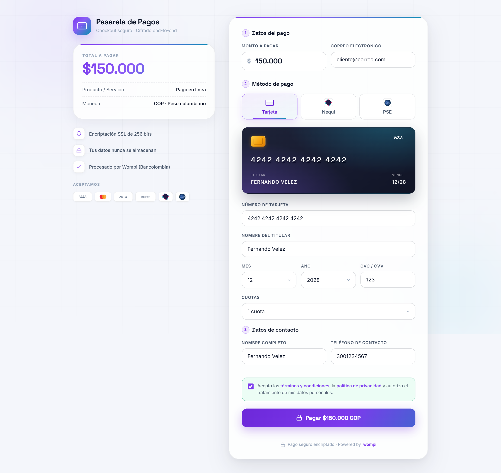
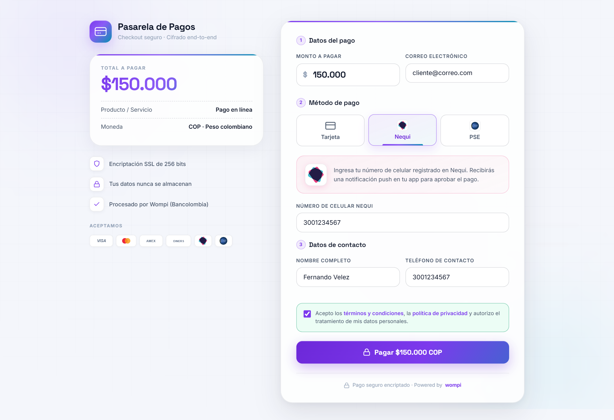
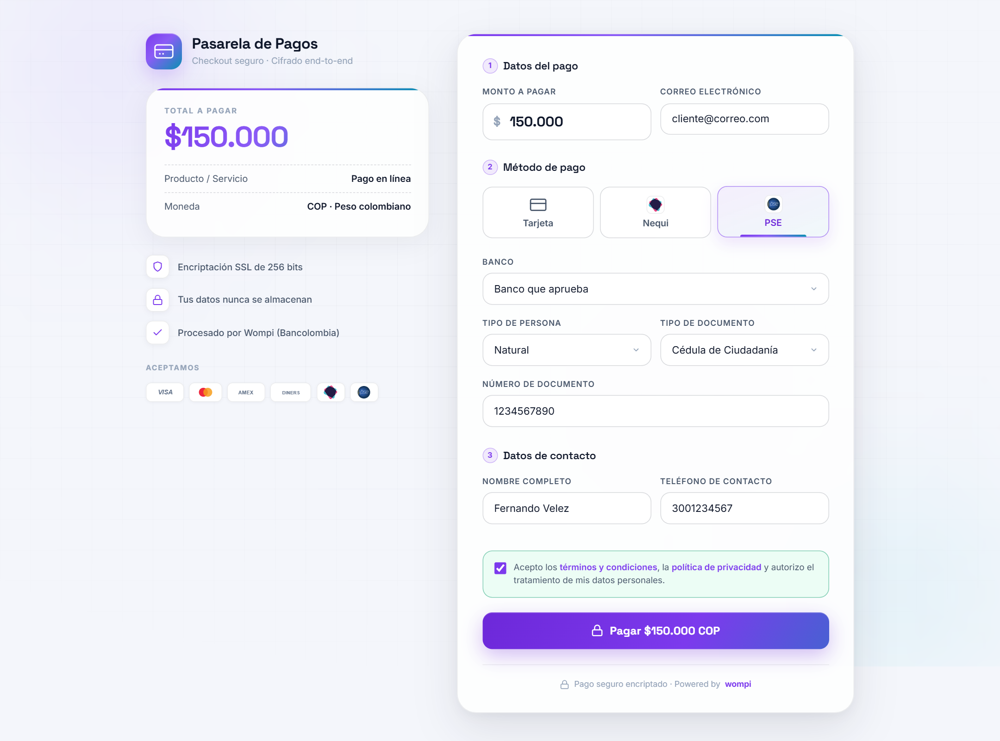
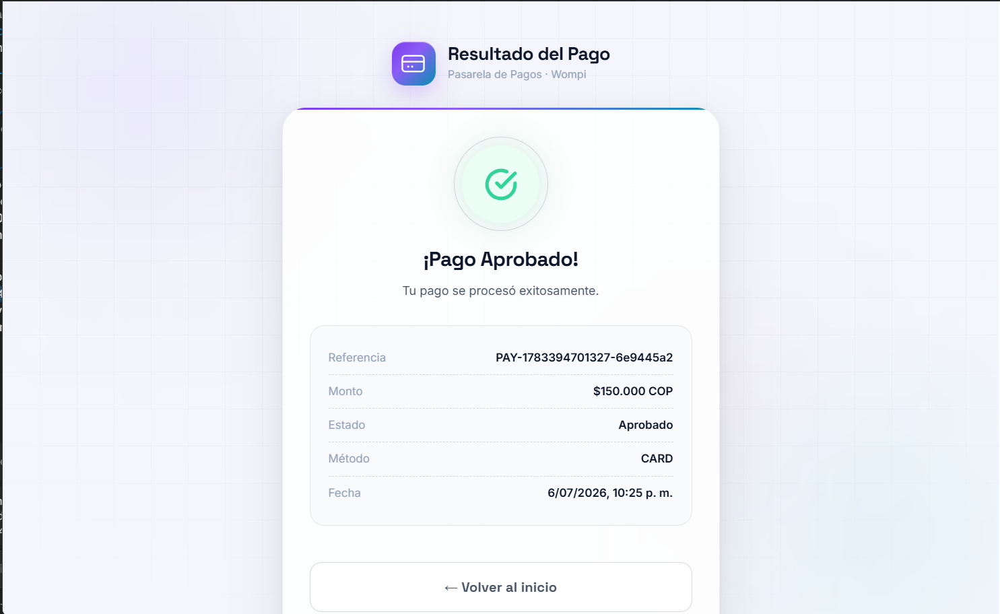

# Pasarela de Pagos

Proyecto de pasarela de pagos orientado a una experiencia moderna, clara y profesional para comercio digital en Colombia. Este repositorio publico muestra la propuesta visual del software y material de presentacion, sin incluir la implementacion interna ni archivos sensibles.

## Vista general

- Experiencia de pago enfocada en claridad, confianza y conversion.
- Diseno visual moderno para checkout y pantalla de resultado.
- Pensado para integraciones de pago en entornos reales de comercio.

## Capturas

### Pago con tarjeta

Checkout con vista previa de la tarjeta en tiempo real, deteccion de franquicia y cuotas.

### Pago con Nequi

Pago con notificacion push a la app de Nequi.

### Pago con PSE

Debito bancario PSE con seleccion de banco y datos del titular.

### Resultado del pago

Comprobante con estado de la transaccion y opcion de imprimir factura.

## Publicacion segura

Este repositorio fue preparado para mantener privada la logica de negocio, configuraciones internas, endpoints, variables de entorno, secretos y archivos de implementacion.

## Contacto

Fernando Velez
